# Linux and Developer-themed Calendars for 2020 :)

Linux logo artwork sourced from **linux.pictures** _(website no longer available)_. Calendars were made using [Inkscape](https://inkscape.org/).

## Arch

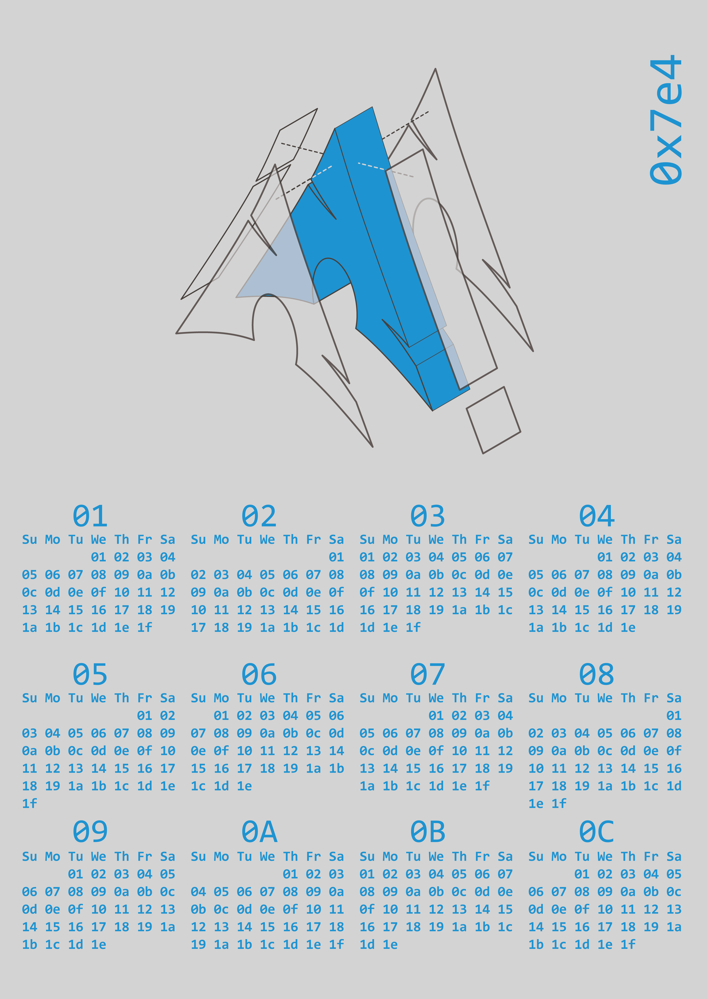

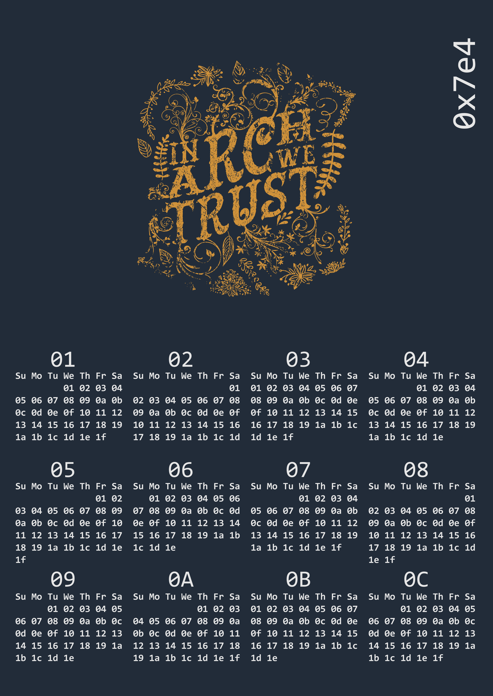

## BSD

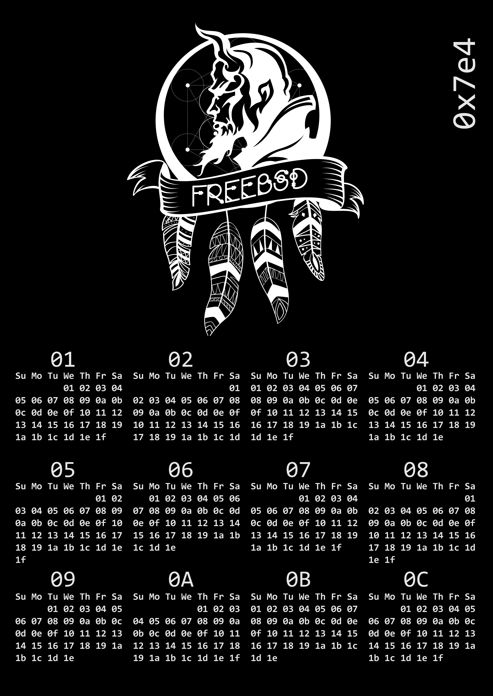

## Debian

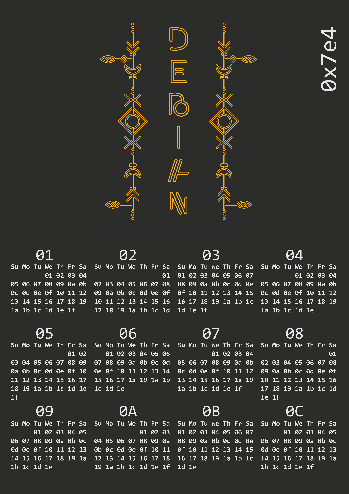

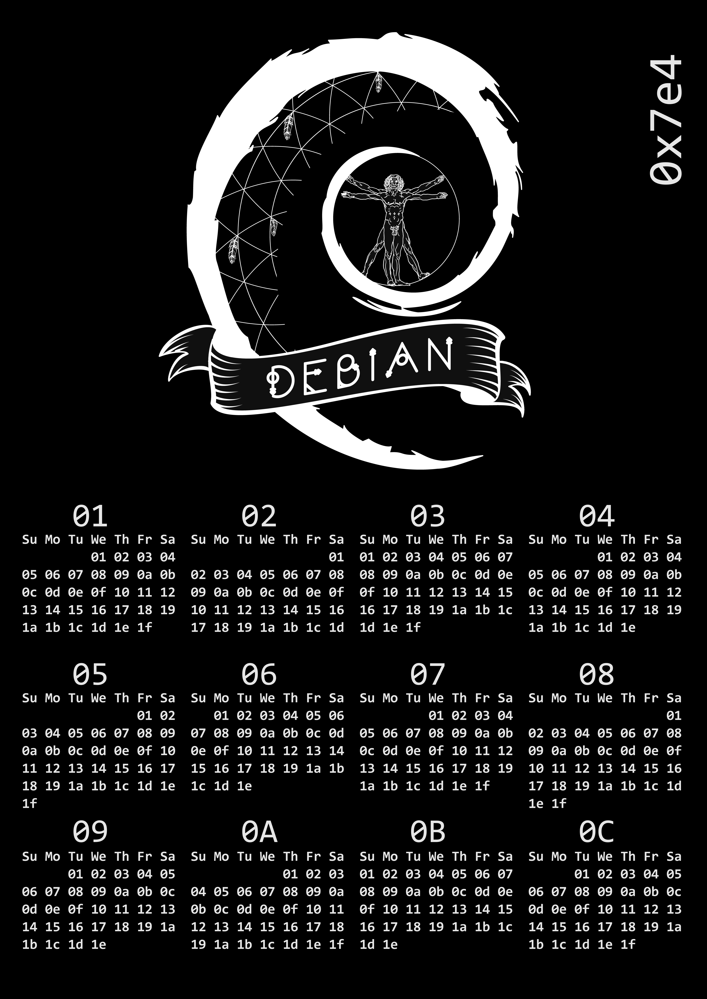

## Fedora

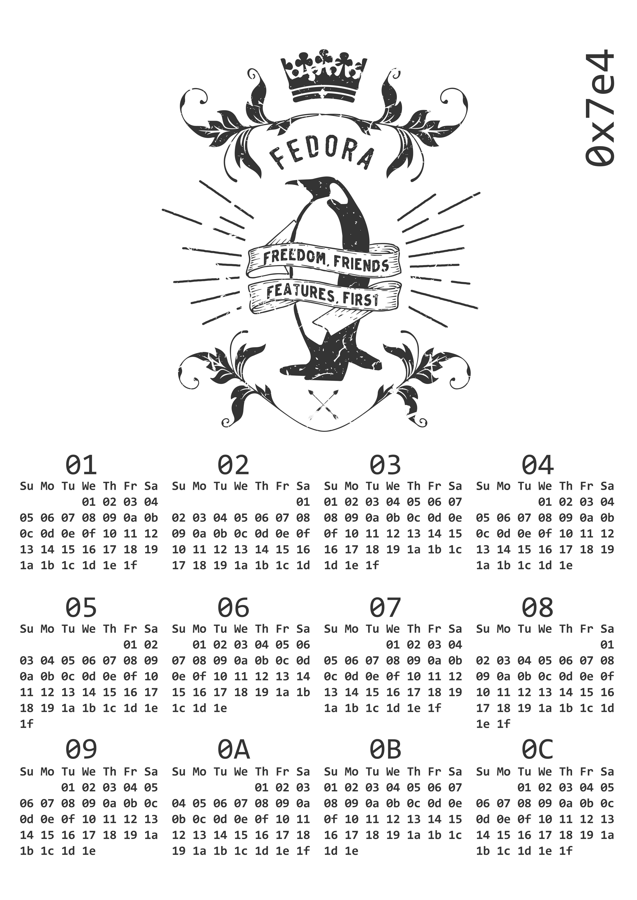

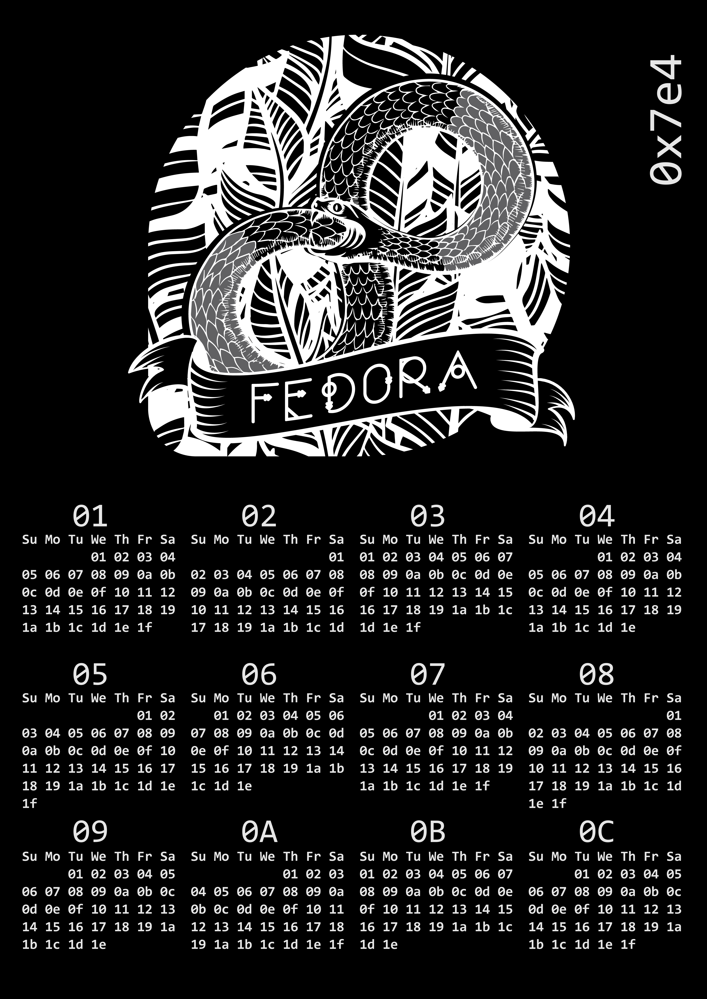

## GCC

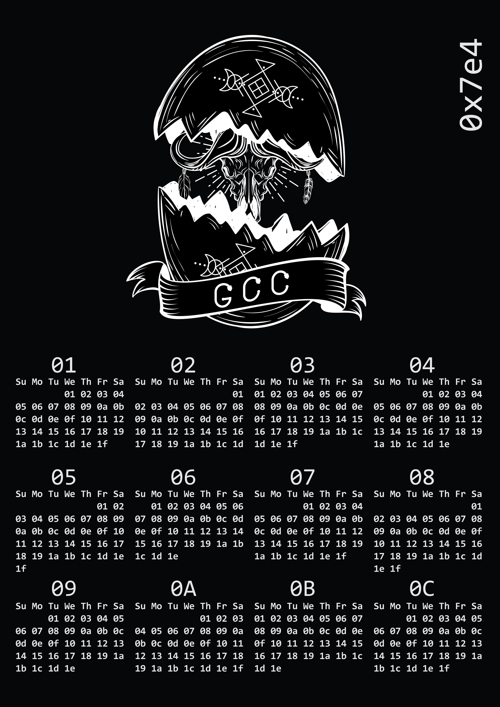

## GNU

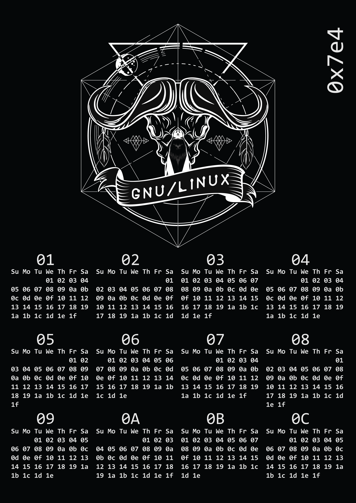

## Linux Kernel

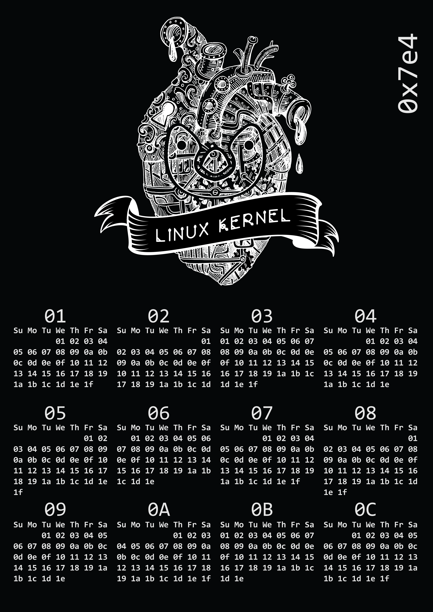

## Manjaro

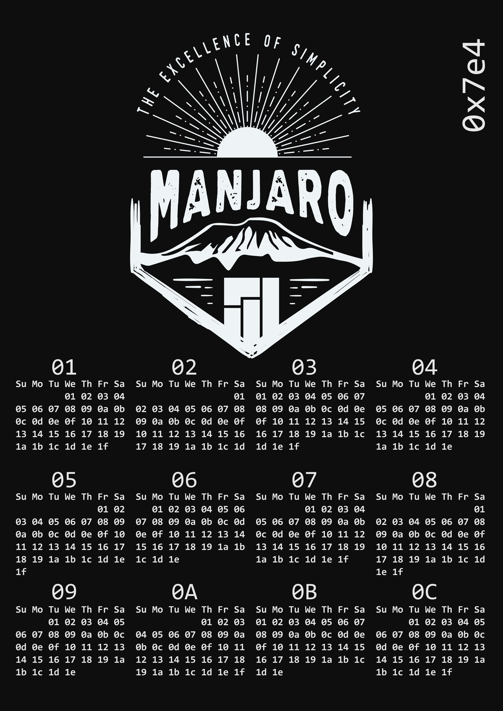

## Mint

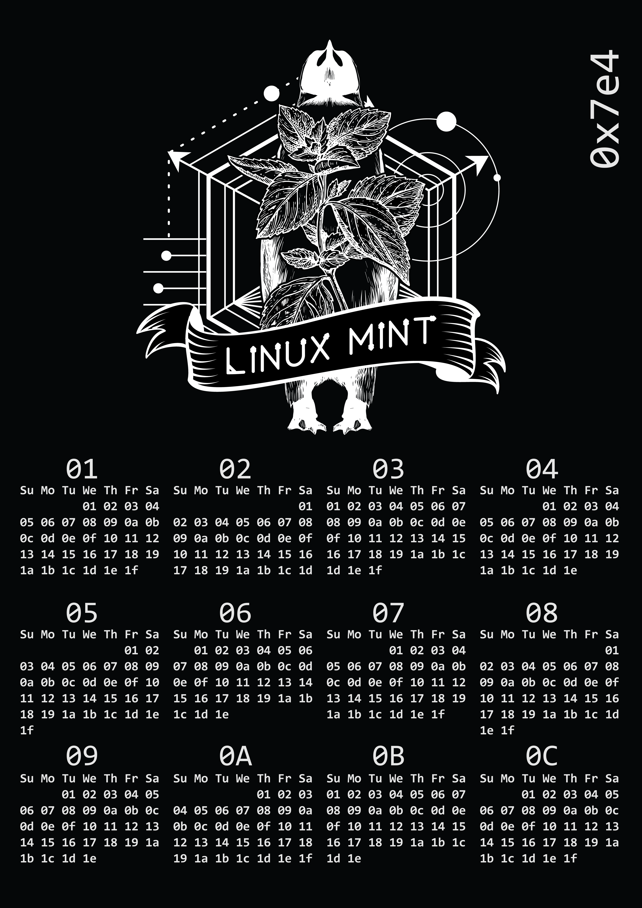

## Python

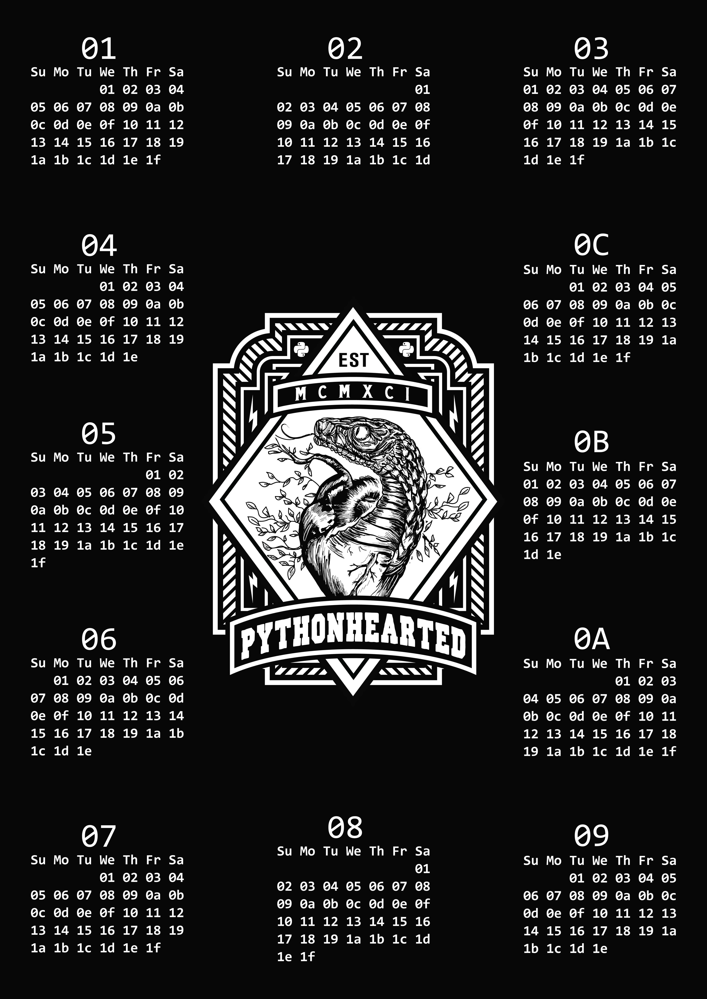

## Ubuntu

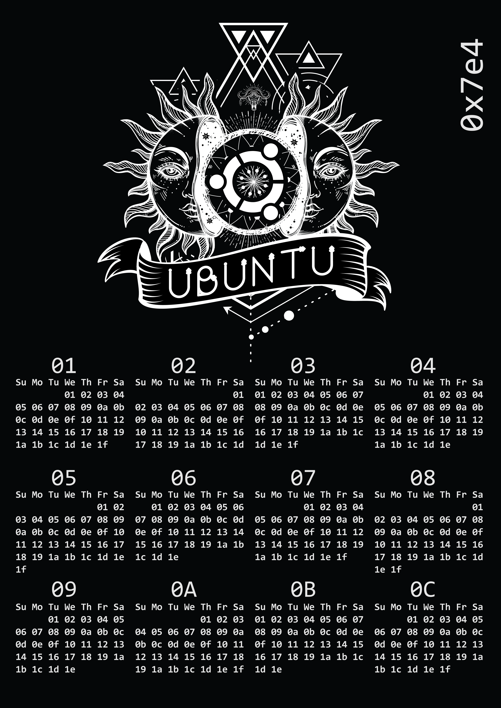
